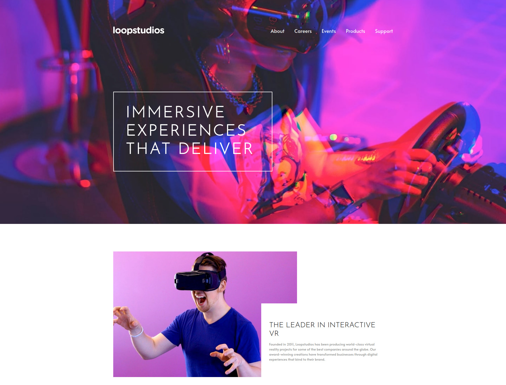

<h1 align="center">LoopStudios Ladingpage</h1>

   Ladingpage - LoopStudios

  <h3>
    <a href="https://carlossantesp.github.io/loopstudios-ladingpage/">
      Demo
    </a>
     | 
    <a href="https://github.com/carlossantesp/loopstudios-ladingpage">
      Solution
    </a>
    
  </h3>

## Table of Contents

- [Overview](#overview)
  - [Built With](#built-with)
- [Install](#install)
- [Contact](#contact)

## Overview

> If you want to see the demo visit the following link [Demo](https://carlossantesp.github.io/loopstudios-ladingpage/)

### Built With

- [Sass](https://sass-lang.com/documentation)
- [Normalize.css](https://necolas.github.io/normalize.css/)
- [BEM](http://http://getbem.com/)

## Install
For this project you need the following plugins in VScode:
- Live Server
- Live Sass compiler

## Contact

- GitHub [@carlossantesp](https://github.com/carlossantesp)
- Linkedin [@dev-santillan-carlos](https://www.linkedin.com/in/dev-santillan-carlos)